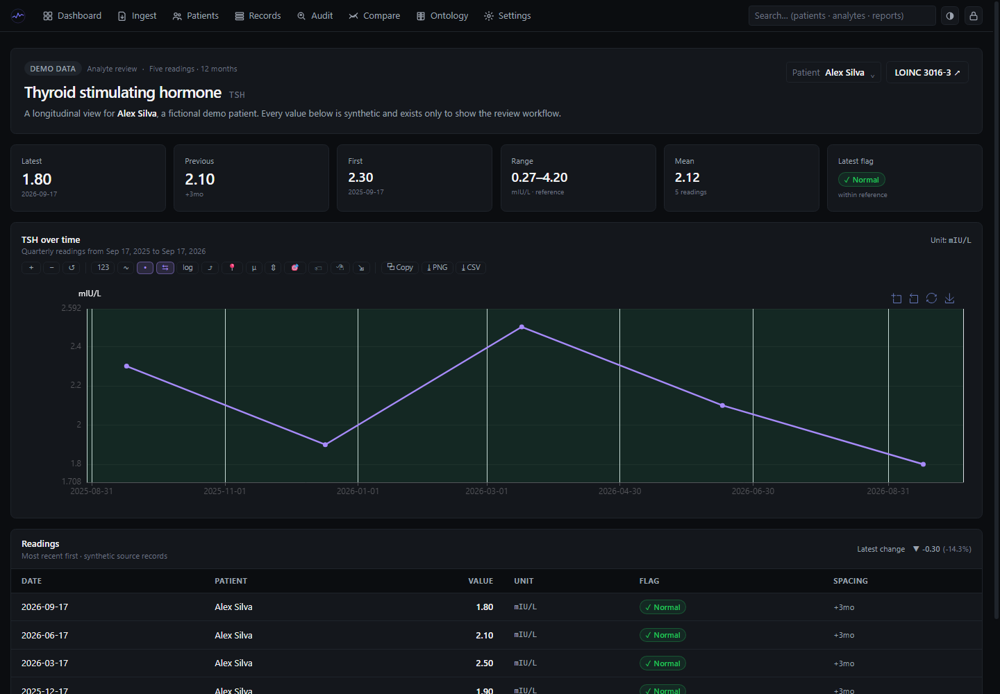

# bloody-level

[](https://github.com/supermarsx/bloody-level/actions/workflows/ci.yml)
[](https://github.com/supermarsx/bloody-level/actions/workflows/docs.yml)
[](https://github.com/supermarsx/bloody-level/releases)
[](license.md)
[](https://v2.tauri.app/)



<p align="center"><sub>Captured from the built-in <code>/demo/analyte</code> view. All patient data is synthetic: five readings at three-month intervals across one year.</sub></p>

Private, local-first desktop software for health-data enthusiasts and
professionals who want to turn pathology-report PDFs into a clear,
longitudinal view of blood-work results.

bloody-level keeps the original report beside the structured record, so you can
move from a source document to extracted values, diagnostics, trends, and
comparisons without handing sensitive health data to a hosted service. It is a
personal tracking and review tool for enthusiasts, analysts, and professionals
working with blood-work records—not a diagnostic service or a replacement for
professional medical advice.

## Contents

- [What is bloody-level?](#what-is-bloody-level)
- [Features](#features)
- [Supported report sources](#supported-report-sources)
- [Quick start](#quick-start)
- [The review workflow](#the-review-workflow)
- [Privacy and data boundaries](#privacy-and-data-boundaries)
- [Documentation](#documentation)
- [For developers](#for-developers)
  - [Development prerequisites](#development-prerequisites)
  - [Useful commands](#useful-commands)
  - [CI and release versioning](#ci-and-release-versioning)
- [Repository layout](#repository-layout)
- [License](#license)

## What is bloody-level?

Most lab reports are useful for a single appointment but awkward to compare
over months or years. bloody-level gives enthusiasts and professionals a
private workspace for working with those reports:

- import one or more PDF reports;
- extract and normalize the values locally;
- review reference ranges, flags, source metadata, and parser diagnostics;
- organize reports by patient and date;
- compare analytes over time with charts, deltas, gaps, and optional anchors;
- keep the original PDF available whenever a structured value needs checking.

The application is designed for one person and one device. It has no required
account, telemetry, analytics, cloud sync, or runtime network service.

## Supported report sources

bloody-level supports Portuguese (PT-PT) pathology and laboratory PDF reports
from CUF and Germano de Sousa. Import machine-readable PDFs directly; optional
OCR can help with scanned or text-poor reports when it is configured locally.

Report layouts can change between departments, report types, and provider
revisions. Always compare extracted values, units, flags, and reference ranges
with the original PDF before using them for discussion or personal decisions.
CUF and Germano de Sousa are referenced as document sources only; bloody-level
is independent and is not affiliated with either provider.

## Features

### Import and review

- PDF import with duplicate detection based on the source file's SHA-256.
- PT-PT PDF support for CUF and Germano de Sousa laboratory reports.
- Local PDFium extraction plus the full OCR/LLM feature set in distributed
  builds. Model-backed tiers are still opt-in and load only when configured.
- Visible parser diagnostics for unmatched analytes, missing values, unknown
  units, unparsed ranges, and low-confidence rows.
- Source metadata and the original PDF kept close to the structured results.

### Understand history

- Patient and report organization for a readable local record.
- Search across patients, reports, and analytes.
- Longitudinal analyte charts with reference bands, deltas, gaps, and filters.
- Comparison views for dates, reports, flags, analytes, and optional anchors.
- CSV export for personal analysis or discussion with a clinician.

### Protect the vault

- Encrypted local SQLite vault for reports, patients, settings, and audit data.
- Password unlock with persisted retry backoff after failed attempts.
- Optional passkey unlock where the platform supports the required capability.
- Native OS-vault unlock through Windows Credential Manager, macOS Keychain, or
  Linux Secret Service, enabled by default on supported platforms for new vaults
  and available as a password-free first-run option.
- Encrypted backup and restore with the copied source PDFs preserved.
- Local model paths and ingestion status shown explicitly; missing capabilities
  are not silently presented as successful processing.

The distributed build compiles Tesseract, olmOCR-2, and Phi-4 integrations.
Settings provides explicit controls to download Tesseract `eng`/`por` data and
the optional model assets; a native Tesseract executable can be bundled at
build time or installed separately. See the [implementation status](docs/reference/status.md).

## Quick start

1. **Install the app.** Download a packaged build from the
   [releases page](https://github.com/supermarsx/bloody-level/releases) when a
   release is available for your platform.
2. **Create your vault.** On first launch, choose a strong password. You can
   register a compatible passkey afterwards as an additional unlock method.
3. **Import a report.** Open **Ingest**, choose one or more blood-work PDFs, and
   wait for extraction and parsing to finish.
4. **Review before relying on it.** Check the patient, date, values, units,
   flags, reference ranges, and parser diagnostics against the original PDF.
5. **Follow the history.** Use the dashboard, patient history, analyte detail,
   and compare views to explore changes over time.

The [installation guide](docs/getting-started/installation.md) explains
platform requirements and the [first-run guide](docs/getting-started/first-run.md)
covers vault setup in detail. If a packaged build is not yet available for
your platform, use the [developer setup](docs/developer/local-development.md)
to run the application from source.

## The review workflow

| Stage    | What you do                                | What stays visible                             |
| -------- | ------------------------------------------ | ---------------------------------------------- |
| Import   | Select a PDF in **Ingest**.                | Source filename, hash, and processing state.   |
| Extract  | Let the local extraction pipeline run.     | Extraction tier and failure details.           |
| Review   | Check the structured rows against the PDF. | Values, units, flags, ranges, and diagnostics. |
| Organize | Confirm patient and report details.        | Audit events and source metadata.              |
| Compare  | Filter history and open charts.            | Dates, deltas, gaps, and report links.         |

## Privacy and data boundaries

- Imported PDFs are copied into the local application-data directory.
- The vault database is encrypted at rest and accessed through the native Rust
  process while unlocked.
- Normal use does not upload reports or require cloud synchronization.
- CSV exports, copied PDFs, screenshots, and backups need their own protection
  once they leave the vault's encryption boundary.
- A flag or reference-range comparison is descriptive context, not a diagnosis.

Read [privacy and encryption](docs/data-and-security/privacy.md) and
[backup and restore](docs/data-and-security/backup-restore.md) before moving
important records between devices.

## Documentation

The complete documentation site is built with MkDocs Material. It is
dark-first, supports light mode, uses nested sections, and includes sidebar
navigation plus instant search with suggestions and highlighted results.

[Read the documentation online](https://supermarsx.github.io/bloody-level/)

- [Install and complete the first run](docs/getting-started/installation.md)
- [Import and review a report](docs/user-guide/ingest.md)
- [Use charts and comparisons](docs/user-guide/compare-and-charts.md)
- [Privacy, encryption, and backups](docs/data-and-security/privacy.md)
- [Troubleshooting](docs/reference/troubleshooting.md)

## For developers

### Development prerequisites

- Node.js 20 or newer with npm.
- Rust through [`rustup`](https://rustup.rs/), with Rust 1.95 or newer for the
  locked dependency set.
- The [Tauri 2 system prerequisites](https://v2.tauri.app/start/prerequisites/)
  for your operating system.

The PDFium sidecar is downloaded during a native build when it is missing. If
that is unavailable, place the matching `pdfium.dll`, `libpdfium.so`, or
`libpdfium.dylib` in `src-tauri/binaries/` and rebuild.

### Useful commands

From the repository root:

```bash
npm ci                  # install the locked frontend dependencies
npm run tauri:dev       # run the desktop application
npm run dev             # run the frontend-only Vite server
npm run check           # run the Svelte type check
npm run lint            # lint the frontend
npm run format:check    # check source and documentation formatting
npm run tauri:build     # build a local Tauri release bundle
npm run docs:serve      # serve the documentation locally
npm run docs:build      # build the documentation strictly
```

Rust checks run from `src-tauri/`:

```bash
cargo fmt --all -- --check
cargo clippy --locked --all-targets -- -D warnings
cargo test --locked --all-targets
```

### CI and release versioning

Pushes run the frontend, Rust, documentation, and cross-platform build gates.
The documentation site is deployed separately by the MkDocs workflow after a
strict build succeeds.

Manual releases use the `YY.N` format for tags, such as `26.1` and `26.2`.
The desktop application metadata uses the semver-compatible form `YY.N.0`.
Builds cover Windows x64/ARM64, Linux x64/ARM64, and macOS x64/ARM64.
Unsigned artifacts are expected until platform signing credentials are
configured.

See the [developer guide](docs/developer/architecture.md),
[testing and CI notes](docs/developer/testing-and-ci.md), and
[release and versioning guide](docs/developer/releases.md) for the full
contributor workflow.

## Repository layout

| Path                         | Purpose                                                                                     |
| ---------------------------- | ------------------------------------------------------------------------------------------- |
| `src/`                       | Svelte frontend and user interface.                                                         |
| `src-tauri/`                 | Rust core, Tauri commands, encrypted database, migrations, parser, and native integrations. |
| `ontology/`                  | Seed analyte library data bundled with the application.                                     |
| `docs/`                      | MkDocs documentation source and site assets.                                                |
| `mkdocs.yml`                 | Documentation theme, navigation, search, and site metadata.                                 |
| `.github/workflows/ci.yml`   | Hosted checks, build matrix, and release publishing.                                        |
| `.github/workflows/docs.yml` | Strict MkDocs build and GitHub Pages deployment.                                            |
| `static/`                    | Frontend and application assets.                                                            |

Never commit real reports, vault databases, passkey material, or private model
assets.

## License

MIT. See [license.md](license.md).
