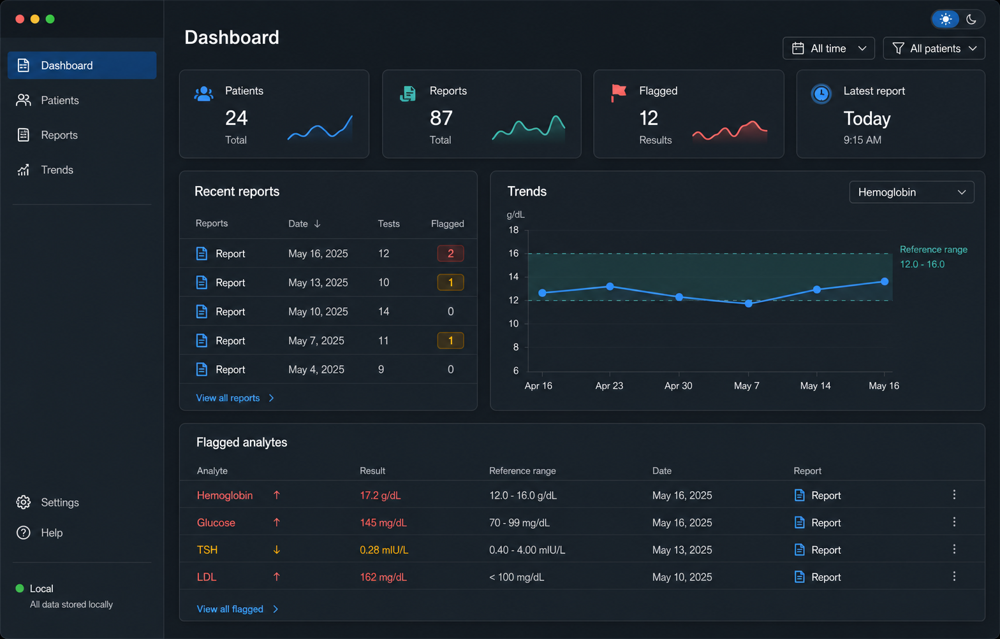

# bloody-level

Local-first desktop app for turning blood-work PDFs into a private,
longitudinal lab dashboard.



## What It Does

bloody-level ingests clinical pathology PDF reports, extracts analytes, and
shows trends over time with reference ranges, deltas, flags, report history, and
patient-level context.

Everything is designed to stay on the device:

- Local encrypted SQLite/SQLCipher vault
- Password unlock with passkey support
- No telemetry and no cloud sync
- PDF text extraction through bundled pdfium
- Optional local OCR/model tiers for harder PDFs
- Dashboard, patients, records, report detail, analyte detail, compare, audit,
  ontology, and settings views

This is a tracking and review tool, not a diagnostic tool. It does not provide
medical advice.

## Current Status

The core desktop app is implemented: encrypted storage, password/passkey unlock,
pdfium ingest, parser, dashboard, patients, records, report detail, analyte
detail, compare, audit, ontology, settings, and CI/release automation.

Optional Tesseract OCR is feature-gated for scanned or low-text PDFs. Embedded
model tiers currently expose settings/status, model file picking, load/unload,
and local model-path validation, but the olmOCR-2 extraction runtime and Phi-4
repair runtime are still pending. See
[docs/implementation-plan.md](docs/implementation-plan.md) for the remaining
OCR/model, PDF-fixture, and release-hardening work.

## Getting Started

Install the usual desktop-app toolchain:

- Node.js 20+
- Rust via `rustup`
- Tauri system prerequisites for your OS

The build script attempts to download the matching pdfium sidecar into
`src-tauri/binaries/` at build time. If that download is unavailable, install
the matching `pdfium.dll`, `libpdfium.so`, or `libpdfium.dylib` there manually.

Then run:

```bash
npm install
npm run tauri:dev
```

## Useful Commands

```bash
npm run dev             # Vite frontend only
npm run tauri:dev       # desktop app in development
npm run check           # Svelte type check
npm run lint            # frontend lint
npm run format:check    # frontend/doc formatting check
npm run tauri:build     # local release bundle
```

Rust checks live under `src-tauri/`:

```bash
cargo fmt --all -- --check
cargo clippy --locked --all-targets -- -D warnings
cargo test --locked --all-targets
```

## Optional Native And Model Tiers

Default builds do not require Tesseract, llama.cpp, or local model files.

- Tier 1 is the default pdfium text-extraction path.
- Tier 2 Tesseract OCR is enabled with Cargo feature `tesseract-ocr` and uses
  the local `tesseract` executable plus tessdata for the configured languages.
- Tier 3 olmOCR-2 status is enabled with `embedded-ocr-vision`; local model-path
  picking/load state exists, but OCR output is not implemented yet.
- Tier 4 Phi-4 repair status is enabled with `embedded-llm`; local model-path
  picking/load state exists, but repair output is not implemented yet.

Downloaded or local model files live in the app data directory, not in the
repository.

## Releases

The repo uses one GitHub Actions workflow: `.github/workflows/ci.yml`.

On pull requests and pushes it runs:

- frontend format check
- frontend lint
- Svelte type check
- Rust format check
- Rust clippy
- Rust tests
- gated Tauri builds

Manual `workflow_dispatch` runs the same checks and builds, then publishes a
GitHub Release using `YY.N` version tags such as `26.1`, `26.2`, and so on. App
metadata is converted to semver for Tauri, for example `26.1.0`.

Unsigned builds are produced unless signing secrets are configured. Apple
notarization/updater placeholders are supported; Windows code signing still
needs a project-specific certificate or signing provider configuration.

Supported signing/update secrets are:

- `APPLE_CERTIFICATE`
- `APPLE_CERTIFICATE_PASSWORD`
- `APPLE_SIGNING_IDENTITY`
- `APPLE_ID`
- `APPLE_PASSWORD`
- `APPLE_TEAM_ID`
- `APPLE_API_KEY`
- `APPLE_API_ISSUER`
- `TAURI_SIGNING_PRIVATE_KEY`
- `TAURI_SIGNING_PRIVATE_KEY_PASSWORD`

## Project Layout

- `src/` - SvelteKit frontend
- `src-tauri/` - Rust backend, Tauri config, SQLite migrations
- `ontology/` - analyte seed data
- `static/` - static assets used by the frontend and README
- `docs/implementation-plan.md` - remaining implementation plan
- `plan.md` - original architecture and product plan

## Data Location

App data lives outside the repository and is git-ignored:

- encrypted database
- keystore
- imported PDFs
- downloaded/local model files

See `.gitignore` for the full list of ignored runtime artifacts.

## License

MIT. See [license.md](license.md).
